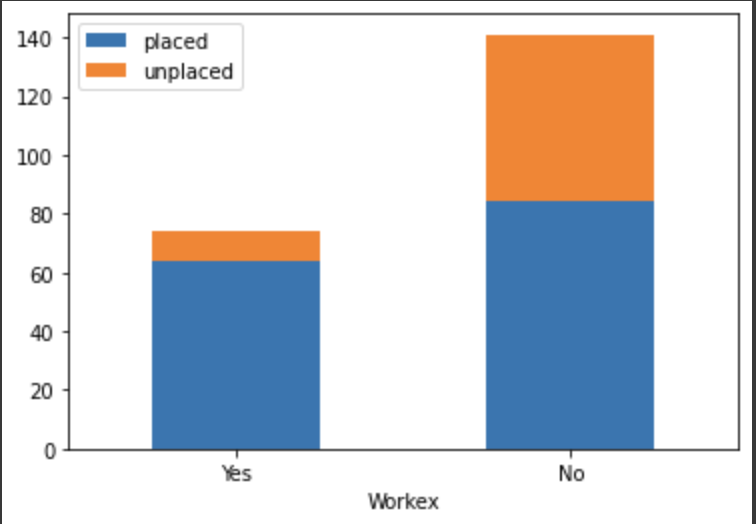
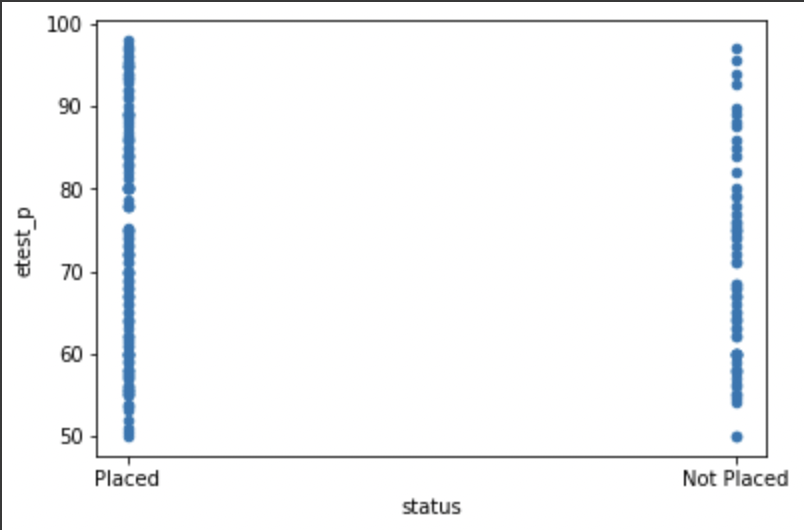
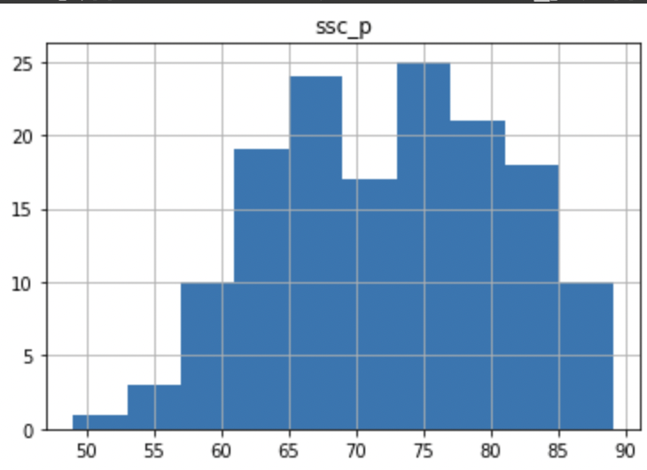
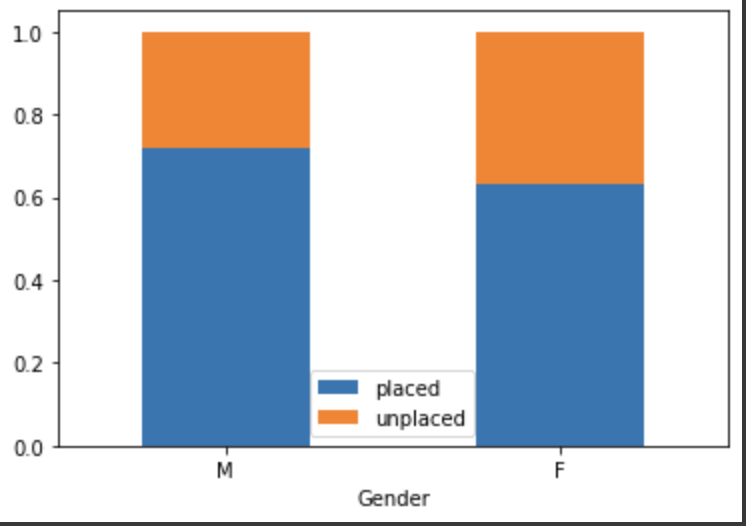

# Placement Data Analysis

The dataset includes secondary and higher secondary school percentages and specializations. It also contains degree specialization, work experience, and the salary offered to the students. The main task is to analyze the factors that affect the placement and salary of students.

Here we considered various factors one after another that might affect the placement and salary of students. We also tried to find out the factors that are most important in deciding the placement and salary of students.

## Work Experience vs Placement

The following graph shows the number of students placed and not placed based on their work experience.



From the graph we can find that the percentage of students placed is higher for students with work experience. But there are less people with work experience, so we should standardize the data to make the graph more meaningful.

```py
placed_workex = len(workex_placed) / (len(workex_placed) + len(workex_unplaced))
unplaced_workex = 1 - placed_workex

placed_no_workex = len(no_workex_placed) / (len(no_workex_placed) + len(no_workex_unplaced))
unplaced_no_workex = 1 - placed_no_workex
```


Thus we conclude that work experience is an important factor in deciding the placement of students.

## MBA Percentage vs Placement

We first showed a scatter plot of MBA percentage for placed and unplaced students.


We can observe a shift in the MBA percentage range for the placed and unplaced students - the max percentage for placed students is higher than the max percentage for unplaced students, and min percentage for placed students is also higher than the min percentage for unplaced students.

However, the top performers and bottom performers can be seen as outliers. For the majority of students, there is a fairly even distribution of the MBA percentage regardless of their placement status.

However, we do not know the frequency distribution of the students. To understand this, we plot a histogram.

Rounding off percentage values in order to gain approximation.

```py
rounded_df = df.round(decimals=0)

rounded_placed_df = rounded_df[rounded_df['status'] == 'Placed']
rounded_unplaced_df = rounded_df[rounded_df['status'] == 'Not Placed']

rounded_placed_df.hist('mba_p')
```


```py
rounded_unplaced_df.hist('mba_p')
```


Using:

```py
placed_df['mba_p'].mean(axis=0)
```

We get the mean MBA percentage for placed students as 62.5793. Similarly, we get the mean MBA percentage for unplaced students as 61.6128 . Similarly, the median percentage for the placed students is 62.245 and for the unplaced students is 60.69 .

The frequency distribution of the MBA percentage confirms that although the overall performance of placed students is slightly better than unplaced students, the majority of the students in both categories have performed similarly with marks in the 55-70% category.

Thus, we can conclude that the MBA percentage does not have any significant contribution to the placement status.

## Degree Specialization vs Placement

We first show a bar graph of the number of students placed and not placed based on their degree specialization, specifically Marketing&Finance and Marketing&HR.


The percentage of students placed is higher for students with Marketing&Finance than Marketing&HR specialization. But there are different people with these specializations, so we should standardize the data to make the graph more meaningful.

```py
placed_fin = len(fin_placed) / (len(fin_placed) + len(fin_unplaced))
unplaced_fin = 1 - placed_fin

placed_hr = len(hr_placed) / (len(hr_placed) + len(hr_unplaced))
unplaced_hr = 1 - placed_hr
```


By this analysis we can conclude that there is higher demand of Marketing and Finance majors over Marketing and HR.

The number of students opting for finance is also higher than the number of students opting for HR, as well as the placement percentage is higher for Finance. Thus, we can also conclude that majority of the placed students are in Finance.


Thus, majority of those placed are in Finance.

## Salary distribution by Specialisation

Here we show a bar graph of the salary distribution of students based on their degree specialization. The first one is for Marketing&Finance and the second one is for Marketing&HR.


If you are in Finance, you are more likely to get a lower paying job, but very high paying jobs also exist (outliers).

The pay distribution for HR is more evenly distributed over a smaller range.

From the data, we find the mean salary for Finance is **298852.63** and for HR is **270377.35**.

Similarly, the median salary for Finance is **270000.0** and for HR is **255000.0**.

Thus, the overall salary is better for Finance specialisation.

## Employability Test Percentage

We first show a scatter plot of employability test percentage for placed and unplaced students.



A distribution of the employability test percentage for placed students.


A distribution of the employability test percentage for unplaced students.


The mean employability test percentage for placed students is **73.2380** and for unplaced students is **69.5879**.

The median employability test percentage for placed students is **72.0** and for unplaced students is **67.0**.

The employability test percentage is a stronger indicator of placement status than the MBA percentage. We can see that the overall performance is better for the placed students. The majority of the students in both categories have performed similarly with marks in the 60-80% category.

## Degree percentage

We first show a scatter plot of degree percentage for placed and unplaced students.


A distribution of the degree percentage for placed students.


A distribution of the degree percentage for unplaced students.


The mean degree percentage for placed students is **68.74** and for unplaced students is **61.13**.

The median degree percentage for placed students is **68.0** and for unplaced students is **61.0**.

There is a clear trend visible for the degree percentage. The placed students tend to have a higher score in their degree. The max percentage for placed students exceeds 90%, whereas the max score for unplaced students does not reach 80%.

The average performance of placed students is also better. The lowest score for placed students is higher than the lowest score for unplaced students.

## Degree Type

The following are the different degree types and the number of students placed in each of them.

```py
Comm&Mgmt    102
Sci&Tech      41
Others         5
Name: degree_t, dtype: int64
```

The following are the different degree types and the number of students not placed in each of them.

```py
Comm&Mgmt    43
Sci&Tech     18
Others        6
Name: degree_t, dtype: int64
```

Calculating the probability of being placed for each degree type.

```py
comm_placed_prob = deg_placed['Comm&Mgmt'] / (deg_placed['Comm&Mgmt'] + deg_unplaced['Comm&Mgmt'])
sci_placed_prob = deg_placed['Sci&Tech'] / (deg_placed['Sci&Tech'] + deg_unplaced['Sci&Tech'])
```

> Probability of getting placed from commerce: 0.7034482758620689

> Probability of getting placed from science: 0.6949152542372882

Both are almost equal probabilities, with very little difference between them. Thus, we can conclude that both commerce and science are streams which allow students to get placed (with a reasonable success rate of around 70%).

> Probability of getting placed from other fields: 0.45454545454545453

However, students who got a degree apart from commerce or science have a very poor success rate in placements of approx. 45%.

However, it is to be noted that we only have 11 data points for this category of students and so, data analysis for this category may not be very reliable.

## HSC Percentage

We first show a scatter plot of HSC percentage for placed and unplaced students.


A distribution of the HSC percentage for placed students.


A distribution of the HSC percentage for unplaced students.


The mean HSC percentage for placed students is **69.92** and for unplaced students is **58.39**.

The median HSC percentage for placed students is **68.0** and for unplaced students is **60.33**.

The HSC percentage is a strong indicator of placement status. The overall performance is better for the placed students. The majority of the students in both categories have performed similarly with marks in the 60-80% category.

## SSC Percentage

We first show a scatter plot of SSC percentage for placed and unplaced students.


A distribution of the SSC percentage for placed students.



A distribution of the SSC percentage for unplaced students.


> Mean SSC percentage of placed students: 71.7214864864865

> Mean SSC percentage of unplaced students: 57.54402985074626

> Median SSC percentage of placed students: 72.5

> Median SSC percentage of unplaced students: 56.28

Thus we can see that the mean and median SSC percentage for placed students is higher than that of unplaced students. This is a strong indicator of placement status.

## HSC Specialization

The following are the different HSC specializations and the number of students placed in each of them.

```py
Commerce    79
Science     63
Arts         6
Name: hsc_s, dtype: int64
```

The following are the different HSC specializations and the number of students not placed in each of them.

```py
Commerce    34
Science     28
Arts         5
Name: hsc_s, dtype: int64
```

Calculating the probability of being placed for each HSC specialization.

```py
comm_placed_prob = hsc_s_placed['Commerce'] / (hsc_s_placed['Commerce'] + hsc_s_unplaced['Commerce'])
sci_placed_prob = hsc_s_placed['Science'] / (hsc_s_placed['Science'] + hsc_s_unplaced['Science'])
arts_placed_prob = hsc_s_placed['Arts'] / (hsc_s_placed['Arts'] + hsc_s_unplaced['Arts'])
```

> Probability of getting placed from commerce: 0.6991150442477876

> Probability of getting placed from science: 0.6923076923076923

> Probability of getting placed from arts: 0.5454545454545454

Once again, both commerce and science have an equal standing with close to 70% probability of getting placed.

Arts has a lower placement rate, but the number of data points is low. If we assume that the dataset is an accurate sampling of the population, and that very few students pursue arts, then the HSC Specialization or Degree Type does not matter for most students in their chances of getting placed.

## Gender

Here we show a bar graph for the Male and Female students that are placed and unplaced.


Standardizing the values:

```py
fem_placed = gen_placed['F'] / (gen_placed['F'] + gen_unplaced['F'])
male_placed = gen_placed['M'] / (gen_placed['M'] + gen_unplaced['M'])

pdf = pd.DataFrame({'placed': [male_placed, fem_placed], 'unplaced':
                    [1 - male_placed, 1 - fem_placed]}, index=['M','F'])
ax = pdf.plot.bar(rot=0, stacked=True, xlabel='Gender')
```



Checking the percentage of each gender in the placed students would not yield meaningful results as there is a disproportion in the numbers of men and women.

Instead, we check for the percentage of placements in the case of each gender to standardize the difference in datasets.

> Percentage of women placed: 0.631578947368421

> Percentage of men placed: 0.7194244604316546

Thus, we see that there is a larger percentage of men being employed than women.

This could be due to gender bias in the workforce, or it could be due to the low number of data points for women in this dataset which makes it difficult to generalise.
